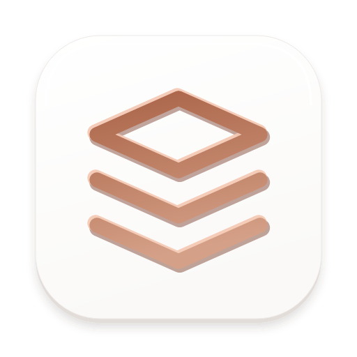
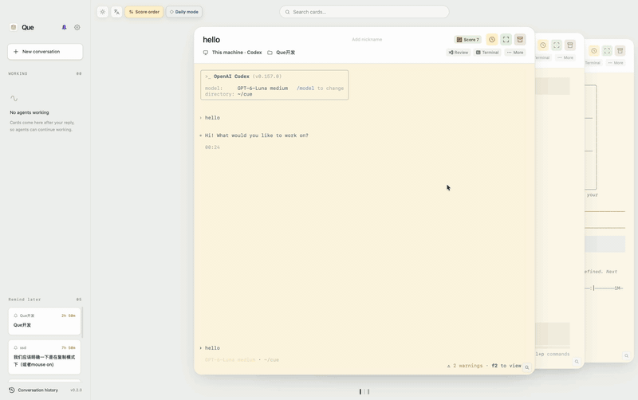
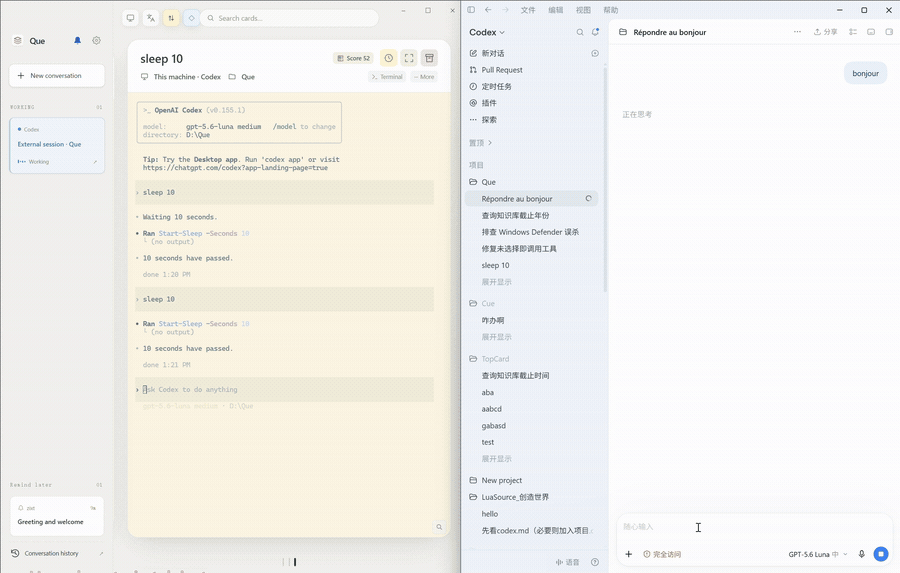
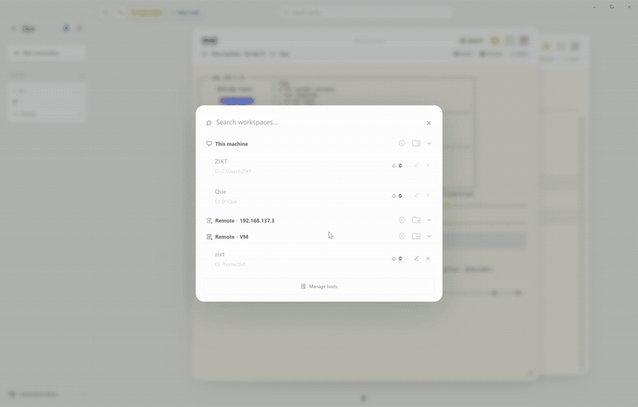
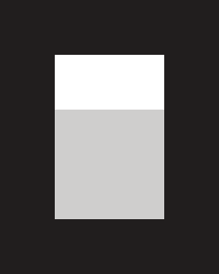
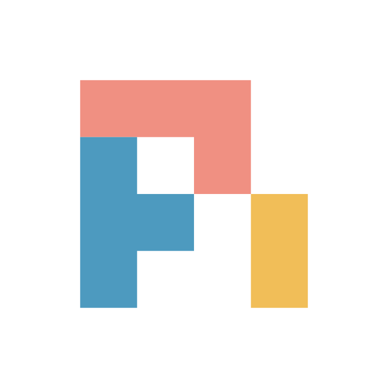

<h1 align="center"> Que</h1>

<p align="center"><strong>Queue of Agent Cues</strong></p>

<p align="center">
  <a href="https://github.com/ZIXT233/Que/releases/latest"></a>
  <a href="https://github.com/ZIXT233/Que/releases"></a>
  <a href="LICENSE"></a>
  
  
</p>

<p align="center">
  <a href="README.md">English</a> · <a href="README.zh-CN.md">简体中文</a> ·
  <a href="https://github.com/ZIXT233/Que/issues">Issues</a>
</p>

<h3 align="center"><a href="https://github.com/ZIXT233/Que/releases/latest">Download Que</a></h3>

Que schedules your attention with a unified queue of agent sessions, so you can just handle the one at the front without wondering which agents are still waiting for your reply.

Que lets you work directly with mainstream CLI agents in terminal cards, or receive notifications from sessions running elsewhere in notification cards. Que puts both kinds of cards in the same queue so you can handle them one by one.

## Features

<table>
<tr>
<td width="45%" valign="middle">
<h3>Pending-reply card queue</h3>
<p>Sessions waiting for a reply enter the queue. After your reply, they move to the working sidebar and return when they need you. Includes priority sorting, FIFO, reminders and separate windows.</p>
</td>
<td width="55%"><a href="docs/assets/queue-demo.gif"></a></td>
</tr>
<tr>
<td width="45%" valign="middle">
<h3>External sessions</h3>
<p>Enable the corresponding hooks to collect sessions from IDEs, desktop apps and standalone terminals. Reply in the original app; the notice leaves the queue when work resumes.</p>
</td>
<td width="55%"><a href="docs/assets/external-notice.gif"></a></td>
</tr>
<tr>
<td width="45%" valign="middle">
<h3>SSH workspaces & tmux</h3>
<p>Choose an SSH workspace and enable tmux keep-alive. Sessions keep running through a disconnect or client exit. Install the CLI and tmux on the remote host first.</p>
</td>
<td width="55%"><a href="docs/assets/remote-tmux.gif"></a></td>
</tr>
</table>

## Supported harnesses

<p align="center">
   Codex &nbsp;
   Claude Code &nbsp;
   Cursor Agent &nbsp;
   OpenCode &nbsp;
   Antigravity
</p>
<p align="center">
   Pi &nbsp;
   Oh My Pi &nbsp;
   CodeBuddy &nbsp;
   Grok Build &nbsp;
   Devin &nbsp;
   Qwen Code
</p>

Use your existing CLIs, accounts and model settings. Que sets up the integration when launching a card. A plain Shell card is also available. Enable external-session notices per tool in Settings. [Integration docs →](docs/harness/hook-api.md)

### Harness extensions

Que can add CLI harnesses through Node.js extensions. The Qwen Code extension ships with Que; you can place your own in `~/.que/extensions/<id>/`. The CLI and Node.js still need to be installed on the user's machine. See the [extension guide](docs/harness/extensions.md) and [Qwen Code example](examples/harness-extensions/qwen-code/README.md).

## Quick start

1. Download the build for your OS and architecture from [Releases](https://github.com/ZIXT233/Que/releases/latest).
2. Install and sign in to your CLI tool.
3. Choose a tool and workspace in Que, then create a session.

## Build from source

Requires Node.js 22+, Rust and the [Tauri 2 prerequisites](https://v2.tauri.app/start/prerequisites/) for your platform.

```bash
git clone https://github.com/ZIXT233/Que.git
cd Que
npm ci
npm run tauri dev
# Package for the current platform
npm run tauri build
```

App data lives in `~/.que`. See the [harness hook contract](docs/harness/hook-api.md).

## License

[MIT](LICENSE). Third-party components retain their own licenses and notices.

## Friends

[LINUX DO](https://linux.do)
